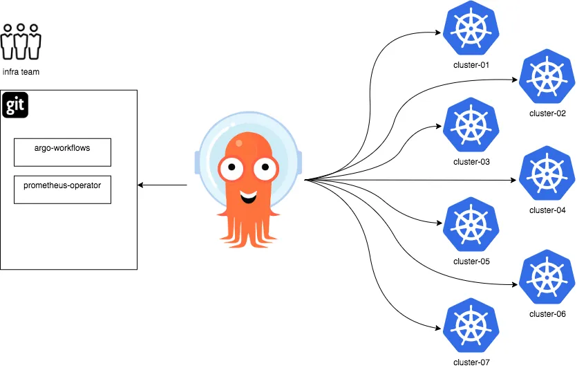

# What does this repository even do?
The main goal of this repository is to act as management cluster for the ArgoCD. It will contain the manifest for the resources/app/application sets that go in the Argo cluster. 

This cluster will have its own monitoring and observability. Likewise it will also contain the Vault things.

Resources in the Argo cluster:
1. Prom/Grafna monitoring
2. Ingress for Argo's API and UI
3. Ingress for Vault's API and UI. (or maybe create a separate vault cluster)


# overall design


Management cluster  ===> Prod cluster, dev clusters, or bunch of clusters

                   +-------------------+
                   | Argo Management   |
                   |     Cluster       |
                   +-------------------+
                      /         \
                     /           \
           +----------------+   +----------------+
           |   Project 1    |   |   Project 2    |
           +----------------+   +----------------+
            /    |    \          /    |    \
           /     |     \        /     |     \
    +-------+  +-------+  +-------+  +-------+  +-------+
    |  Dev  |  |  UAT  |  |  Prod |  |  Dev  |  |  UAT  |
    +-------+  +-------+  +-------+  +-------+  +-------+
    (Cluster)  (Cluster)  (Cluster)  (Cluster)  (Cluster)





### Each clusters will have the following resources:
1. CNI with CILIUM with Hubble stuff enabled
2. Databases like mysql, postgres, oracle db, mongo db, cassandra
3. Big data stuff: Hadoop, spark, airflow and other things needed
4. Monitoring and observaility with Prometheus, grafana, data dog, dynatrace and ELK
5. Ingress with Nginx and maybe others like Kong,Traefik
6. Service mesh
7. MQs : Kafka, Rabbit MQ
8. Cert Manager : lets encrypt
9. Secrets injection: Azure, secrets manager, Vault secrets and others
10. Custom network policies 
11. Maybe bgp stuff for on premises
12. RBAC and stuff
13. Oauth login 
14. DNS: external dns
15. Kubecost: for cost tracking
16. Autoscaling: karpenter , cluster autoscaler


# Install argocd in the cluster
```
kubectl create namespace argocd

kubectl apply -n argocd -f https://raw.githubusercontent.com/argoproj/argo-cd/stable/manifests/install.yaml 
```

### How to manage argo by argo itself?
- Add the install.yaml file in argo-cd folder. 
- Create an application that refers to the install.yaml 
- Run the init bash command to install Argocd file.


### CI/CD steps
- Dev merges PR to master
- Docker image build , tagged with short sha and semver and pushed to ECR
- Update the helm chart values
- Application in Argo updates the cluster based on the helm chart value in the repository. 
- Store helm chart in the repo

### Add cluster to ArgoCd
To add a external cluster to a argocd. Follow these steps.
1. Must be logged in to argocd

Get argocd password:
```
argocd admin initial-password -n argocd 
```

```
argocd login localhost:8080
```

Add the cluster now:
```
argocd cluster add k8-argo-mgmt-cluster --
```
List argocd clsuters:
```
argocd cluster list

```

### Delete namespace

```bash
NAMESPACE="ingress-nginx"

kubectl get namespace $NAMESPACE -o json > $NAMESPACE.json
kubectl replace --raw "/api/v1/namespaces/$NAMESPACE/finalize" -f ./$NAMESPACE.json


### ARgo cd tls bootstrap steps:
```bash
kubectl create -n argocd secret tls argocd-tls-tls \
  --cert=/path/to/cert.pem \
  --key=/path/to/key.pem

## for dex
kubectl create -n argocd secret tls argocd-dex-tls-tls \
  --cert=/path/to/cert.pem \
  --key=/path/to/key.pem

```


### Create tls certs for argocd 

Generally you would create a CA (ca private key and ca certificate) and create CSR and sign the certificate from CSR with the CA's private key. 
```bash

1. with CA
# create a ca
openssl req -x509 -sha256 -days 10000 -newkey rsa:2048 -keyout certs/ca/rootCA.key -out certs/ca/rootCA.crt

## gen csr
openssl req -newkey rsa:2048 -keyout argocd-tls.key -out certs/argocd-tls.csr

```
### sign the certificate with CA certificate and CA private key
```
openssl x509 -req -CA ca/rootCA.crt -CAkey ca/rootCA.key -in argocd-tls.csr -out argo-meow.crt -days 365 -CAcreateserial

```

2. Just create a generic private key and sign the certificate with the private key
## gen private key
openssl genrsa -out certs/argocd-tls.key 2048


### gen the certifiate directly without csr with the private key
 openssl req -x509 -new -nodes -days 365 -key argocd-tls.key -out test.crt -subj "/CN=argo.k8.macgain.net"


#### Create k8 secret 
```bash

kubectl create secret tls argocd-tls-secret --cert=./certs/argo-tls.crt --key=./certs/argocd-tls.key -n argocd
kubectl create secret tls argocd-tls-secret --cert=test.crt --key=argocd-tls.key -n argocd


```


## OR use Cert-Manager with Lets envrypt for SSL certs
- If domain is managed through cloudflare disable proxy it fails ths validation requests
- Use annotations in ingress
- Cert manager creates Certificate and Secrest, can also take care of rotation of the certs.


### Vault
Vault installation guide: https://developer.hashicorp.com/vault/tutorials/kubernetes/kubernetes-raft-deployment-guide 
```
helm repo add hashicorp https://helm.releases.hashicorp.com
```

### post installation of vault

1. init the vault
exec into the vault pod
```
vault operator init
```
Save the 5 unseal keys. Distribute it. lol

```
Unseal Key 1: CsLdlYznUeG/rB1He2krzZ79jovedraKPak4ejWHqUpZ
Unseal Key 2: FRx8OtnZJbgDHkb7XEJ6ntv3uCkBszsKyZlbHUJB/IQi
Unseal Key 3: a8g5wr4TFH3hdc5VmjQzgDmGJYuxKq9GgbaPGV3VH4HV
Unseal Key 4: Uyi2hiCQcETZ4PcDPmaxMRQQrsMXvsHLyWXPkxylyhr5
Unseal Key 5: IIVF9Z+g6trzMC+wNPZAuyK4fgNCqsRp3RjnQYFijjYz
```
Also the initial root token. The root token can also be envrypted with pgp.
```
hvs.m4cE6DuVWYhrQzNPUTmlyBj9

```

Can also encrypt the unseal keys with pgp keys.

```
vault operator init \ 
-key-shares=3 \
-key-threshold=2 \
-pgp-keys="keybase:hashicorp,keybase:jefferai,keybase:sethvargo"
```

keu-shares=3 means there are three pgp keys used. 
key-threshold=2 means there should be at least 2 keys to unlock.


2. unseal the vault
Run the unseal command 3 times with the 3 out of 5 unseal keys.
```
vault operator unseal

```